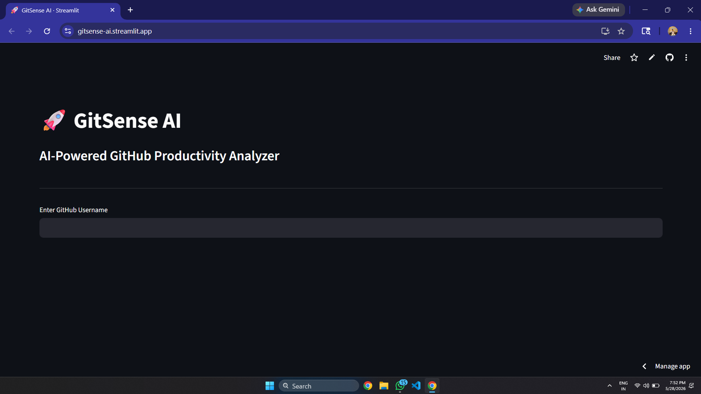

# 🚀 GitSense AI

AI-Powered GitHub Productivity Analyzer built using Streamlit, GitHub API, and AI-driven analytics.



---

# 🌟 Features

✅ GitHub Profile Analysis  
✅ AI Developer Score  
✅ Repository Analytics  
✅ Contribution Heatmap  
✅ Most Used Languages Detection  
✅ Recruiter Mode Insights  
✅ AI-Based Developer Summary  
✅ PDF Report Download  
✅ Interactive Visualizations  
✅ Live GitHub Data Fetching  

---

# 🧠 Problem Statement

Recruiters and developers often struggle to quickly analyze GitHub profiles and understand coding productivity, contribution consistency, and technical strengths.

GitSense AI solves this problem by transforming raw GitHub profile data into intelligent AI-powered developer analytics.

---

# 💡 Solution

GitSense AI fetches real-time GitHub data and generates:

- Developer performance score
- Repository analytics
- Contribution activity
- Technical skill analysis
- AI-generated recruiter insights
- Downloadable PDF reports

---

# 🛠️ Tech Stack

- Python
- Streamlit
- Plotly
- Pandas
- GitHub REST API
- FPDF
- AI-based analytics

---

# 📊 Functionalities

## 🔍 GitHub Profile Analyzer
Analyze any public GitHub account instantly.

## 📈 Repository Analytics
Visualize repository stars, forks, and technologies.

## 🔥 Contribution Heatmap
Track yearly GitHub activity consistency.

## 🤖 AI Recruiter Insights
Generate intelligent developer evaluation summaries.

## 📄 PDF Report Export
Download complete developer reports instantly.

---

# 🚀 Live Demo

🔗 https://gitsense-ai.streamlit.app/

---

# 📸 Screenshots

## 🏠 Home Page


---

# ⚡ Installation

```bash
git clone https://github.com/yourusername/GitSense-AI.git

cd GitSense-AI

pip install -r requirements.txt

streamlit run app.py
```

---

# 👨‍💻 Future Scope

- GitHub Profile Comparison
- AI Resume Analyzer
- Developer Ranking System
- Team Collaboration Insights
- ML-based Developer Prediction

---

# 🏆 Hackathon Submission

Built for GitHub Copilot Dev Days Hackathon.

---

# 👨‍💻 Author

Yuvraj Malviya

GitHub:
https://github.com/yuvrajjuv
